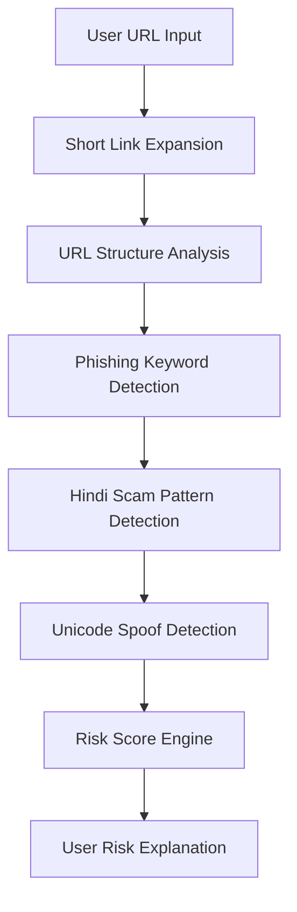

# 🛡️ AI Phish Guard

#### Detecting deception before it detects you.

AI Phish Guard is a context-aware phishing detection system designed to identify multilingual and behaviour-driven phishing attacks using structural URL analysis and social-engineering pattern detection.

It provides users with a clear visual explanation of risk instead of just saying “safe” or “dangerous”.

---

##  Live Demo

🔗 https://ai-phish-guard.onrender.com

---

## Research Motivation

Many phishing detection systems rely primarily on blacklists or static pattern matching. However, modern phishing campaigns increasingly use localized language targeting and social engineering tactics.

This project explores whether behavioral risk signals and multilingual pattern analysis can improve early phishing detection for emerging digital populations.

---

##  Features

-  Context-aware phishing detection
-  Short link expansion awareness
-  Behavioural phishing signal analysis
-  Domain structure anamoly detection
-  Confidence breakdown
-  Human-readable risk explanation
-  Multilingual phishing detection (Hindi/English)
-  Unicode spoofing detection
-  Mobile responsive interface
-  Visual scan timeline

---
## Detection Pipeline

---
## Threat Landscape

Modern phishing attacks are evolving beyond simple fake login pages.

Attackers increasingly exploit:

- Regional languages (such as Hindi)
- Unicode spoofing techniques
- Shortened links to hide malicious domains
- Psychological urgency tactics

Traditional phishing detection systems often miss:

- Language-targeted scams
- Script-based deception
- Behavioral manipulation patterns

AI Phish Guard explores whether behavioral signals and multilingual analysis can help detect these attacks earlier.

---

##  Tech Stack

Frontend:
- HTML
- CSS
- JavaScript

Backend:
- FastAPI (Python)

Deployment:
- Render

---


##  Detection Signals 

| Signal | Purpose |
|-------|--------|
| Shortened links | Hide malicious destination |
| Phishing keywords | Urgency & manipulation |
| Domain structure | Fake authority mimicry |
| Hindi keywords | Regional targeting |
| Hindi script usage | Unicode spoof attempts |

---

##  Example Detection

The system can flag:

- Shortened phishing links  
- Urgent scam language  
- Suspicious domain structures  
- Hindi phishing wording  
- Unicode deception  


---

##  Language Support

Users can switch between:

- English Mode
- Hindi Mode

All explanations dynamically translate.

---

## Limitations

This prototype currently relies on heuristic-based detection signals such as structural URL analysis, keyword detection, and behavioural risk indicators.

It does not yet incorporate large-scale machine learning models, live threat intelligence feeds, or dataset-driven training pipelines.
As a result, detection accuracy may vary for novel phishing techniques that do not match the current signal patterns.

--- 

## Future Improvements

Several extensions could strengthen the system and improve detection capabilities:

- Integration of machine learning models trained on phishing URL datasets
- Real-time threat intelligence feeds for known malicious domains
- Expanded multilingual phishing detection beyond Hindi
- Browser extension integration for real-time user protection
- Improved Unicode spoof detection using character similarity analysis
- Behavioral phishing pattern learning from real-world datasets
- Risk scoring models that combine multiple signals dynamically

---

##  Installation (Local Setup)

```bash
git clone https://github.com/Keertilata20/ai-phish-guard.git
cd ai-phish-guard
pip install -r requirements.txt
uvicorn main:app --reload
